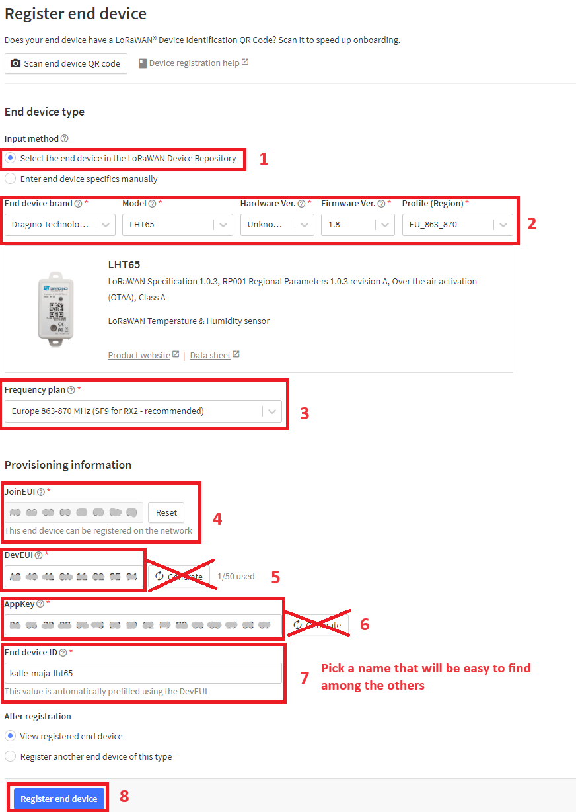

### 1. Log on
Got to [The things network console](https://console.cloud.thethings.network/). Select Europe 1 (eu1) and choose the `Login with The Things ID` option to log in. Use the credentials provided by the instructor.

### 2. Add your sensor to the application

Go to 'applications' and click on the one called `Basic Workshop`.Once there, navigate to `Register end device` in the bottom-right corner to add your *Sensor* to the application. For some sensors the details are already added in TTN. Search for its brand name in the search bar under "End device brand". In the table below all details are provided for each sensor. 

|End device brand|model|Hardware Ver.| Firmware Ver | Profile(Region)|Frequency Plan|
|------|-----|-------------|--------------|----------------|--------------|
|browan|TBMS100|
|dragino|LHT65|"Unknown"|1.8|EU_863_870|Europe 863-870 MHz(SF9 for RX2 - recommended)|

Enter the `JoinEUI/AppEUI`, `DevEUI` and the `AppKey` that are provided. Make sure that you change `End device ID` to something that is easy to remember, for example your names. Click `Register end device`.

Below is an example of how it can look while registering a LHT65. 

Once you register your device, you will be directed to the device page, which should look similar to the image below. 

### 3. Start sensor

Go to the user manual or datasheet of the sensor you are using and find out how to activate it. When activated most sensors will try to join a network

|link to manual|picture|
|--------------|-------|
|[tabs - TBMS100](https://iot-shop.de/en/shop/gem-pir-tabs-tbms100-motion-sensor-pir-4362#attr=2496,812,2497,2345,819,824,811,2494,3303,3302,11839,12909,14208,15049,15700,16180,16380,15942,14475)| |
|[Dragino - LHT65](https://media.distrelec.com/Web/Downloads/_t/ds/113990756_eng_tds.pdf)||

In The Things Network `Live data`, we can read the sensor values in the payload (as hex). In the example we can see 17 (23 in decimal), which is our temperature, followed by 30 (48 in decimal), which is our humidity. 

If you made it this far, congratulations! 🥳 

You can now move on to visualizing the data! 